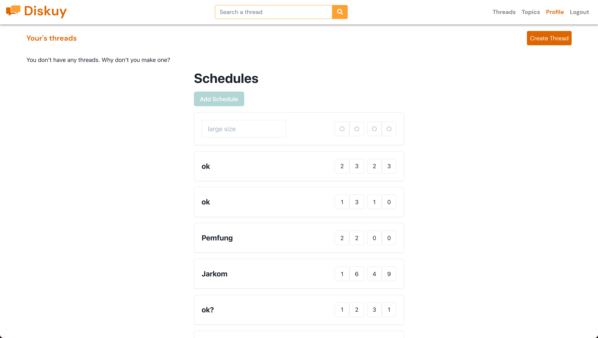
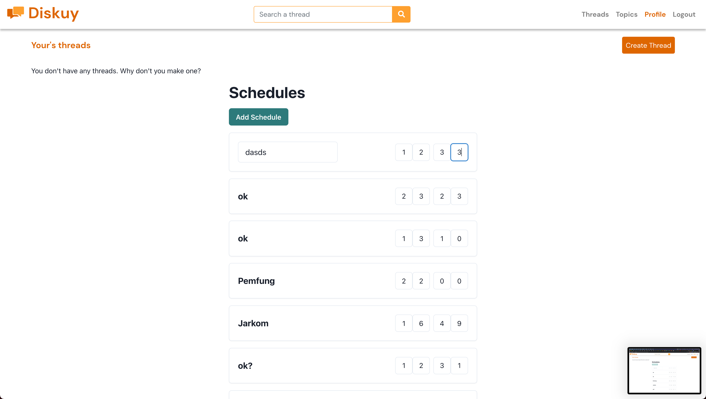
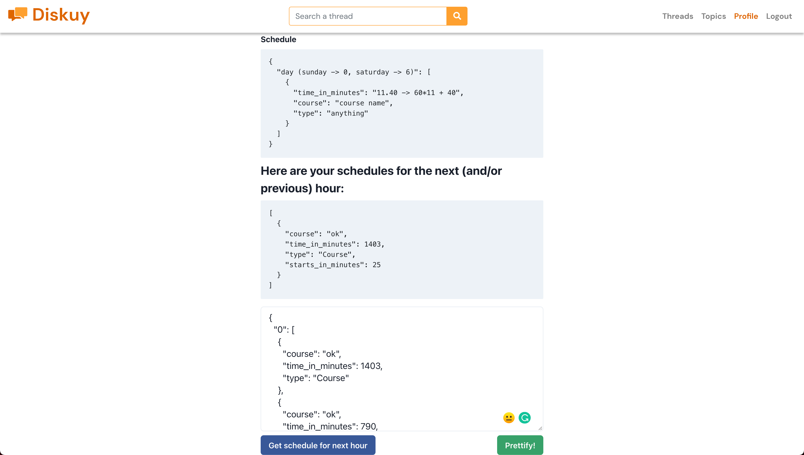

## Relevant Links

deployment: https://funpro-lambda.netlify.app/.netlify/functions/

faas: https://github.com/jojonicho/funpro-lambda

frontend: https://gitlab.cs.ui.ac.id/funpro-5/diskuy-frontend/-/merge_requests/3

## Screenshots





## Proses pengerjaan

Pertama-tama dan tahap yang paling sulit adalah mencari ide proyek yang berhubungan dengan tugas kelompok. Pada akhirnya saya memutuskan untuk membuat `Schedule` berdasarkan email dari yang dimiliki ketika autentikasi.

Pertama-tama saya menyusun fungsinya dan dites melalui postman. Setelah sudah sesuai outputnya, saya lanjut ke frontend menggunakan React.

Untuk fungsi yang lebih rumit, saya menggunakan firebase dan perlu membaca docs dan setup terlebih dahulu, lalu kembali mengetes dan mengerjakannya di React.

Untuk melakukan api call, saya menggunakan built in `fetch` pada react dan juga `axios`.

Pada akhirnya, dilakukan deployment untuk FaaS yang telah saya buat menggunakan netlify-functions.

## Functional Programming

Pada segi functional programming, saya menerapkannya pada bagian frontend atau React dengan menggunakan functional components. Walaupun functional, tetap dapat memiliki sebuah state dengan menggunakan hooks seperti `useEffect`, `useState`, dll. Selain itu, saya pun menerapkan clean code dengan memodularize masing - masing functional component sesuai dengan kegunaannya.

Untuk sisi FaaS, saya menerapkan functional programming dengan tidak adanya global variable, dan dengan beberapa fungsi seperti `filter` dan `map`. Selain itu, saya juga mencoba menerapkan pure function pada `schedule.ts` yang menerima object schedules dan timestamp,lalu mengembalikan schedules dengan jam mulai yang perbedaannya maksimal 1 jam dari timestamp tersebut.

## Analisis Biaya

Fungsi-fungsi yang dibuat sangat sederhana, dan dibuat secara efisien dimana kompleksitas maksimal linear atau $O(N)$.

Selain itu, tidak ada fungsi yang dapat menciptakan infinite loop, pencegahan biaya melonjak akibat infinite loop.

## Running

```
netlify functions:serve --port=8000
```
